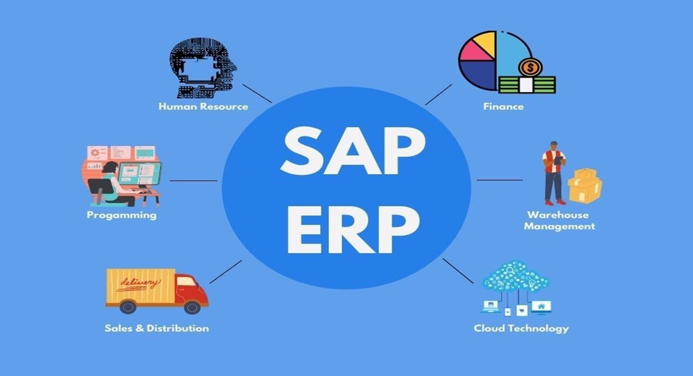
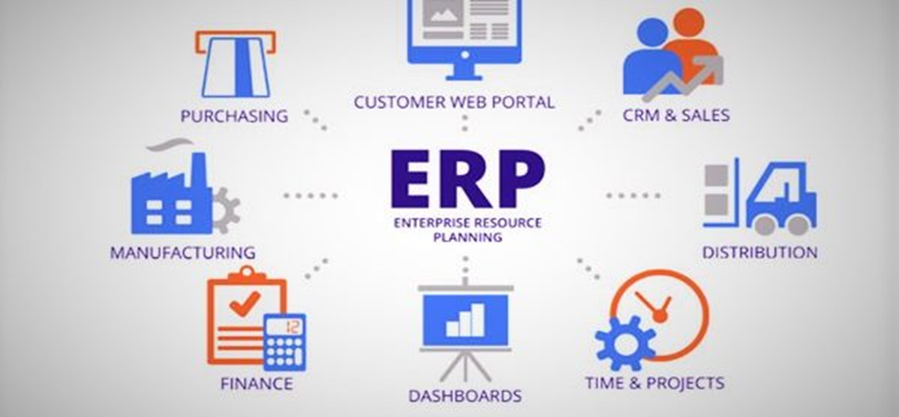
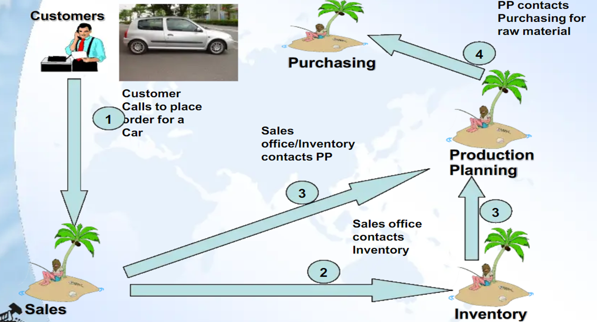
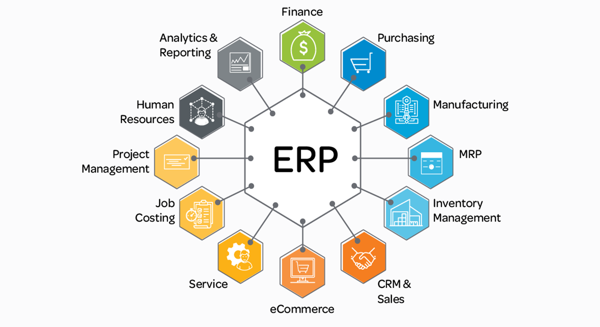
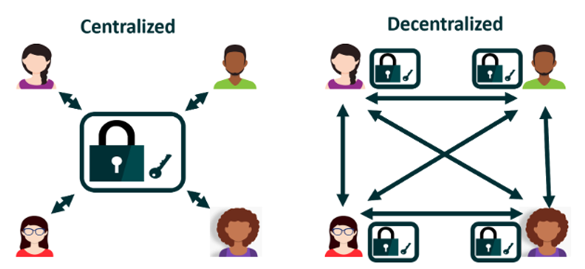

<h1 align="center" style="font-weight: bold;">SAP ERP</h1>
<h2 align="center" style="font-weight: bold;">Introduction</h2>

ERP significa planejamento de recursos empresariais. Os sistemas ERP são o tipo de ferramenta de software usada para gerenciar os dados de uma empresa.

### Tradução:

Costumer = Cliente;  
Sales = Vendas;  
Inventory = Inventário;  
Production Planning = Planejamento de Produção;  
Purchasing = Comprando/Aquisição.

### Tradução:

Finance = Finanças;  
Purchasing = Comprando/Aquisição;  
Manufacturing = Fabricação;  
MRP (Material Requirements Planning) = Planejamento de Necessidades de Materiais;  
Inventory Management = Gestão de Estoque;  
CRM (Costumer Relationship Management) & Sales = Gestão de Relacionamento com o Cliente & Vendas;  
E-Commerce = Comércio Eletrônico;  
Service = Serviço;  
Job Costing = Custo do Trabalho;  
Project Management = Gerenciamento de Projetos;  
Human Resources = Recursos Humanos;  
Analytics & Reporting = Análises & Relatórios;

O **SAP S/4HANA** pode ser configurado tanto em um modelo **centralizado** quanto **descentralizado**, dependendo da necessidade da empresa.

### 🔹 SAP em um modelo Centralizado
No modelo tradicional, o SAP funciona de forma centralizada, integrando todos os módulos (Financeiro, Logística, Vendas, Produção, etc.) em um único sistema e banco de dados. Esse modelo garante:  
✔ **Dados unificados**: todas as áreas acessam a mesma base de dados em tempo real.  
✔ **Menos redundância**: elimina a necessidade de múltiplos sistemas.  
✔ **Maior controle**: gestão centralizada da informação.  

### 🔹 SAP em um modelo Descentralizado
Apesar de ser tradicionalmente centralizado, algumas empresas podem optar por um **modelo descentralizado**, onde diferentes unidades ou subsidiárias utilizam sistemas SAP independentes que podem ou não se comunicar entre si. Isso ocorre quando:  
✔ Há **unidades operando de forma independente**.  
✔ é necessário atender **diferentes legislações locais**.  
✔ A empresa usa um **modelo híbrido**, onde algumas funções são locais e outras centralizadas.  

### 🏆 Conclusão
* Se o SAP está rodando **em uma única instância**, com todos os módulos integrados, ele é centralizado.  
* Se a empresa utiliza **múltiplas instâncias do SAP (ou sistemas separados por unidade de negócio)**, então ele é **descentralizado**.  

Na prática, **grandes empresas costumam ter uma abordagem híbrida**, onde algumas funções são centralizadas (como finanças), enquanto outras (como produção) podem ser descentralizadas para melhor eficiência operacional.

